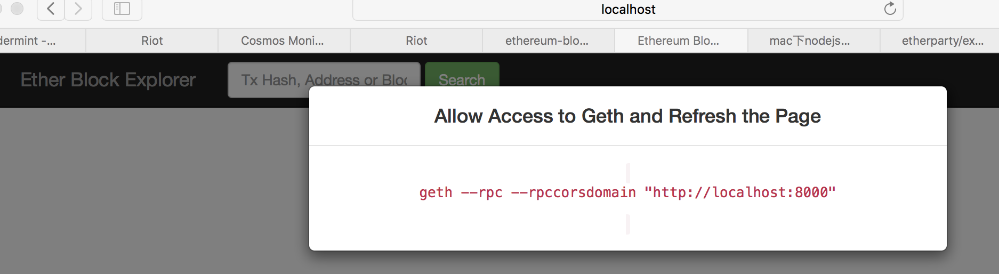

# install explorer

    git clone https://github.com/etherparty/explorer

# install nodejs and npm
可以去nodejs官方网站下载mac平台的安装包。
    
# update nodjs
    
    1、使用npm安装n模块
    sudo npm install -g n  #n模块是专门用来管理nodejs版本的
    
    2、升级nodejs
    sudo n stable          #升级到稳定版本
    sudo n latest          #升级到最新版本
    
# start explorer program
    
    npm start
    启动服务，等待浏览器访问。
    

# install geth

   请参考官方指南。
# create genesis file
    
    cat genesis.json
        {
            "config": {
              "chainId": 10,
              "homesteadBlock": 0,
              "eip155Block": 0,
              "eip158Block": 0
            },
            "alloc"      : {},
            "coinbase"   : "0x0000000000000000000000000000000000000000",
            "difficulty" : "0x20",
            "extraData"  : "",
            "gasLimit"   : "0x2fefd8",
            "nonce"      : "0x0000000000000042",
            "mixhash"    : "0x0000000000000000000000000000000000000000000000000000000000000000",
            "parentHash" : "0x0000000000000000000000000000000000000000000000000000000000000000",
            "timestamp"  : "0x00"
        }
   
# init chain
  
    geth init genesis.json
    以太坊数据默认保存在～/Library/Ethereum/geth/chaindata目录下。
    
   
# create account

    geth account new
    记住创建账户时用的口令！解锁账户时需要用到。创建的地址保存在～/Library/Ethereum/keystore目录下。
    
# start geth 

    geth --rpc --rpccorsdomain "http://localhost:8000" --unlock 0xfa6c1c12429235a55497221ddecf44591bc2b29d --mine console
    进入控制台之前，需要输入口令解锁账户！解锁之后进入控制台，开启挖矿（不用miner.start()）
    
# visit browser

    http://localhost:8000
    效果如下：
    

# conclusion    

本文演示了浏览器连geth的基本步骤。

# 误区
1、不能在阿里云服务器上跑explorer，却在本地mac的浏览器上访问。它们得在一台机器上。

# open source ethereum block explorer resource

可以在private chain使用的开源以太坊区块浏览器。
1、https://github.com/maran/ethereum-blockchain-explorer
2、https://github.com/etherparty/explorer （本文使用的浏览器版本）

   

    